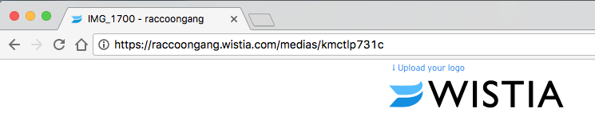
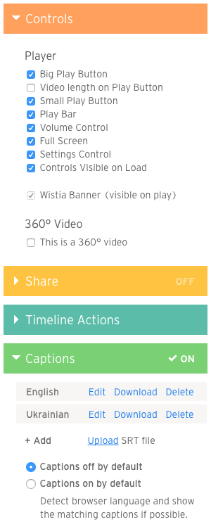
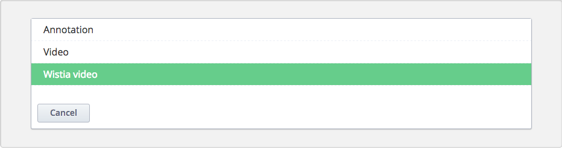
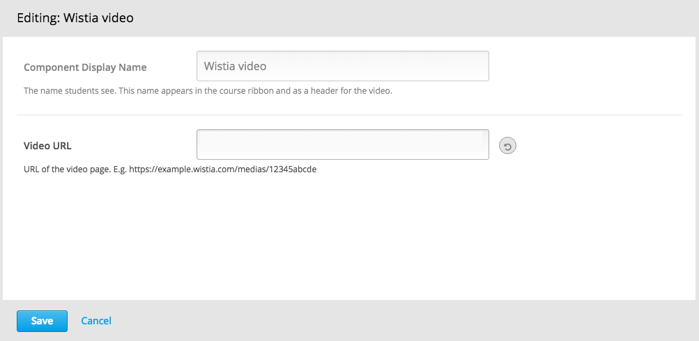

# xblock-wistia
XBlock to embed videos hosted on the Wistia video platform into your courses.

## Installation

```bash
pip install -e "git+https://github.com/appsembler/xblock-wistia.git#egg=wistiavideo_xblock"
```

## Enabling in Studio
You can enable the Wistia xblock in studio through the advanced
settings:

1. From the main page of a specific course, click on *Settings*,
   *Advanced Settings* in the top menu.
1. Check for the *Advanced Module List* policy key, and add
   `"wistiavideo"` in the policy value list.
   

1. Click on the *Save changes* button.

## Usage

Before adding wistia xblock to your course you need to have video uploaded to the Wistia.

You can get video url for the Xblock directly from your browser's address bar.



For better students experience make sure all player controls are enabled and video captions are uploaded.



To add Wistia video block to a unit, choose *Wistia video*From the *Advanced Components* list int the Studio.



Click the *Edit* button to open up a form where you can enter module title and avideo url address.



## Running Tests

```bash
nosetests wistiavideo
```

## License

The code in this repository is licensed under the GPL v3 licence unless otherwise noted.

Please see `LICENSE` file for details.
