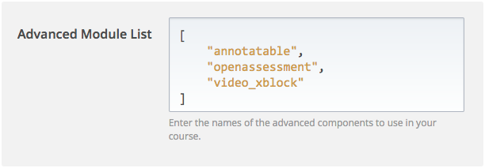

# xblock-video

[](https://travis-ci.org/raccoongang/xblock-video)
[](https://codecov.io/gh/raccoongang/xblock-video)
[](https://github.com/raccoongang/xblock-video/releases)

XBlock to embed videos hosted on different video platform into your courses.

The idea of crowd-funded universal video-xblock was brought to the
audience by Nate (Appsembler) on Open edX Con 2016 in Stanford.
It was well-received and first funds were gathered.

The development was initiated  by Raccoon Gang team, basing on
previously developed wistia-xblock. Raccoon Gang guys created universal
pluggable interface and implemented several video-backends:

- Brightcove
- Html5
- Vimeo
- Wistia
- Youtube

Appsembler and Raccoon Gang are presenting the talk on the story of
video-xblock on Open edX Con 2017 in Madrid.

We welcome open-source community to add more video-backends as well as
fix issues.

## Installation

```shell
sudo -sHu edxapp
source ~/edxapp_env
# Clone and install xblock
git clone https://github.com/raccoongang/xblock-video.git
cd xblock-video
# Install Python and JavaScript dependencies
make deps
```

## Enabling in Studio

You can enable the Wistia xblock in studio through the advanced
settings:

1. From the main page of a specific course, click on *Settings*,
   *Advanced Settings* in the top menu.
1. Check for the *Advanced Module List* policy key, and add
   `"video_xblock"` in the policy value list.
   

1. Click on the *Save changes* button.

## Usage

TODO

## Development

Install dependencies and development tools:

```shell
> make deps deps-test tools
```

Run quality checks:

```shell
> make quality
```

Run tests:

```shell
> make test
```

## License

The code in this repository is licensed under the GPL v3 licence unless
otherwise noted.

Please see `LICENSE` file for details.
